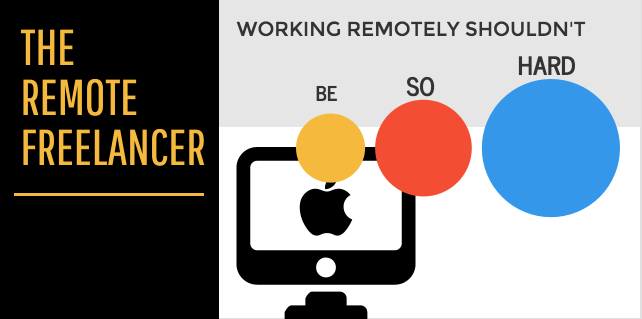

  

# The Remote Freelancer
List of community-curated resources to find topical remote freelance &amp; contract work for software developers, web designers, and more!

## Why
This repo was inspired by [this Hacker News thread](https://news.ycombinator.com/item?id=12773282) about one software developer's experience with Upwork. For all those who have had bad experiences with Upwork, I wanted to create a list of additional resources that software developers can use to find freelance, nomadic and contract work.

## Contributing
Please please please contribute to the list! If you have freelance work available or know someone who does, feel free to open a pull request to augment this list! If PRs come in quite regularly, I'll bother to create a website and backend for it.

Also, if anyone would like to make a proper logo for this, I'd be eternally grateful. I whipped this one together using [VennGage](https://venngage.com).

Thank you for looking :) Good hunting!

# The List

## English language

- [10xmanagement](https://www.10xmanagement.com/) - Hire the Best Freelance Tech Talent. It has served customers like MIT, AMEX, yelp and even Google.
- [Angel List Jobs](https://angel.co/jobs#find/f!%7B%22remote%22%3Atrue%7D) - Apply privately to thousands of the best startup jobs.
- [Authentic Jobs](http://www.authenticjobs.com/#onlyremote=1) - Full-time and freelance job opportunities for creatives.
- [#freelance](http://freelance.chat/) - A community for freelancers on Slack
- [#frontenddevelopers.org](http://frontenddevelopers.org/) - A Slack powered community for creative developers to share knowledge
- [Codeable](https://codeable.io/) - Remote jobs for top WordPress developers.
- [Code Gophers](https://codegophers.com/) - Your personal army of programmers. Email us a programming task and we'll finish it in 48 hours. [Become a Gopher](https://codegophers.com/apply.html)
- [CodeMentor.io](https://codementor.io) - Get paid while making an impact. Become a Codementor for the next wave of makers.
- [CodersClan.net](https://codersclan.net) - Become a verified coder and do coding tasks with bounty between 25USD and 800USD
- [Coworks.com](https://coworks.com/for-freelancers/) - \#1 freelance work platform for the creative industries.
- [Crew](https://crew.co/) - Handpicked Freelance Web Designers & Developers
- [Domino](https://www.wearedomino.com/freelancer) - Recommendation-only freelancing. Has a Slack channel for networking & discussions.
- [DOZ.com](https://www.doz.com) - Plan your digital marketing campaigns and outsource them to marketing pros.
- [Dribbble Jobs](https://dribbble.com/jobs?utf8=%E2%9C%93&amp;anywhere=true&amp;location=Anywhere) - Remote jobs for designers.
- [Fiverr](https://www.fiverr.com/) - A freelance plaform for several types of projects and skills.
- [FlexJobs](https://www.flexjobs.com) - Membership site that posts professionally vetted remote, part-time, and flex opportunities. Not exclusive to engineering, but there are a large number of engineering and tech-related jobs on their board.
- [Folyo](https://www.folyo.me) - Freelance Job listing board
- [Golang Jobs](http://www.golangprojects.com/golang-remote-jobs.html) - Remote jobs for Go/Golang developers.
- [Gun.io](https://gun.io/) - Gun.io is the world’s first network for freelance professionals.
- [Guru.com](http://www.guru.com/) - Find & Hire Talented Freelancers. It also comes with [Guru Enterprise](http://www.guru.com/enterprise) to manage large number of freelancers or jobs.
- [HackHands](https://hackhands.com) - Live programming help. Get paid per minute, while helping other programmers.
- [Hired](https://hired.com/) - The marketplace where companies compete to hire top salespeople.
- [Jobbox](https://www.jobbox.io/offers?t=&amp;s=featured&amp) - Connects the best tech candidates with the best jobs.
- [Jobmote](http://jobmote.com/) - A directory of IT career opportunities that allow you to work from home.
- [Jobscribe](http://jobscri.be/) - Get a daily email with remote jobs at tech startups.
- [Lightboard](https://lightboard.io) - bite-sized design projects (4-20hrs) for marketing and sales departments. Vetted clients, managed projects.
- [Loom](https://www.joinloom.com) - work-for-equity platform for entrepreneurs and developers.
- [Nextspace](http://nextspace.us/) - A coworking space for entrepreneurs and developers to work and network (US only for now)
- [No Fluff Jobs](https://nofluffjobs.com/#criteria=remote) - Features remote IT jobs in a standardized and detailed way.
- [PeoplePerHour](https://www.peopleperhour.com) - We help you start small, move fast and build it up!
- [Pilot](https://pilot.co/) - A software platform that removes all the pain from contract work. We find work, negotiate contracts, send invoices and chase payments for hundreds of forward-looking engineers and designers around the world.
- [Pipeline](https://www.pipelinedaily.com/#why-use) - Sends curated projects to your inbox weekly. Made by freelancers for freelancers
- [Remote|OK](https://remoteok.io/) - Let's find you a job you can do anywhere
- [RemoteBase](https://remotebase.io/) - An open database of remote companies
- [Remotely Awesome Jobs](https://www.remotelyawesomejobs.com) - An extensive remote job board aggregator.
- [Seven Days](https://www.sevendays.co/) - Where startups find talent
- [Stack Overflow Careers](http://careers.stackoverflow.com/jobs/remote) - Remote jobs for developers.
- [Toptal](https://www.toptal.com/) - Hire the top 3% of freelance talent
- [We Work Remotely](https://weworkremotely.com/) - Find jobs that aren't restricted by commutes or a particular geographic area.
- [X-Team](http://x-team.com) - Provides motivated developers, ready to join your team. We are the most developer-centric company for remote developers, helping them learn and grow like few tech companies have done before. "Work on incredible projects. Unleash your potential. From anywhere."
- [WFH](https://www.wfh.io/) - A job board focusing on remote jobs in the technology space.
- [Working Nomads](http://www.workingnomads.co/jobs) - A curated list of remote jobs for the modern working nomad.

## French language

- [Codeur](https://www.codeur.com/) - Leader in France.
- [Hopwork](https://www.hopwork.fr/) - Is getting some tractions.

## Dutch language

- [Freelance.nl](https://freelance.nl/) - Leader in the Netherlands.
- [Marktplaats](http://klussen.marktplaats.nl/diensten-en-vakmensen/klussen/0) - Kind of like Craigslist.

## Spanish language
- [Freelancer MX](https://www.freelancer.mx) - Contrata a freelancers expertos para tu trabajo en línea.

### License
None. Literally, why would I include a license in this. Copy, paste, skewer, go nuts. (Ok, officially, "The Unlicense")
